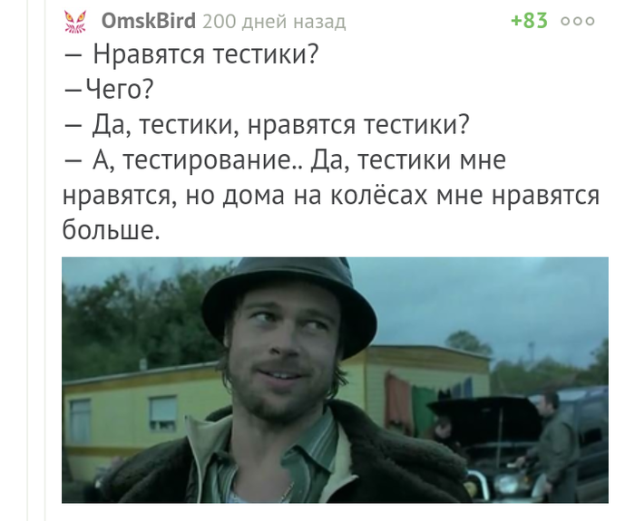

# memes

Мемы бывают [разными](https://habr.com/ru/post/193802/).

Компьютерному зрению тяжело ответить на вопрос - что на рисунке, [чихуахуа или маффин?](https://www.freecodecamp.org/news/chihuahua-or-muffin-my-search-for-the-best-computer-vision-api-cbda4d6b425d/) Человеку, конечно, не легче.

300к в наносекунду - [обычная зарплата разработчика](https://habr.com/ru/post/570430/).

Kaggle - площадка для упоротых дата-саентистов. Где ещё можно [поисследовать мемы](https://www.kaggle.com/c/meme-analysis-challenge)?

ООО мой питончик - питон хорош [всегда](https://xkcd.ru/353/), даже [когда не очень](https://xkcd.com/1987/).

Кот с гаечным ключом устал от [сложных](https://ru.wikipedia.org/wiki/Проблема_вагонетки) и нелогичных [задач](https://xkcd.ru/1134/).

Путь в Подольск [долог](https://xkcd.ru/231/) и опасен, если ты [знаешь статистику](https://xkcd.ru/795/).

Главное - [не путать цвета](https://acomics.ru/~gwtb/2). А кот - это [Nyan-cat](https://www.youtube.com/watch?v=QH2-TGUlwu4).

Дуэли бывают разные. [Дуэль расистов](https://pikabu.ru/story/duyel_rasistov_3959659) - это хорошо, включая комментарии. В [N частях](https://pikabu.ru/story/shutki_pro_negrov_eshche_nemnogo_vnutri_576329).

Инструкции бывают разные, даже [очень нужные](https://xakep.ru/2000/08/22/10510/).

[Большой код](https://pikabu.ru/story/bolshoy_kod_6283330) для любителей [большого куша](https://ru.wikipedia.org/wiki/Большой_куш_(фильм,_2000)).

Вжух - и [всё готово](https://habr.com/ru/post/342950/). Нейросети же так работают. И запускаться можно сразу.

На эту страницу можно зайти по QR-коду. Настоящие айтишники прочитают его [без камеры](https://habr.com/ru/post/127197/)

